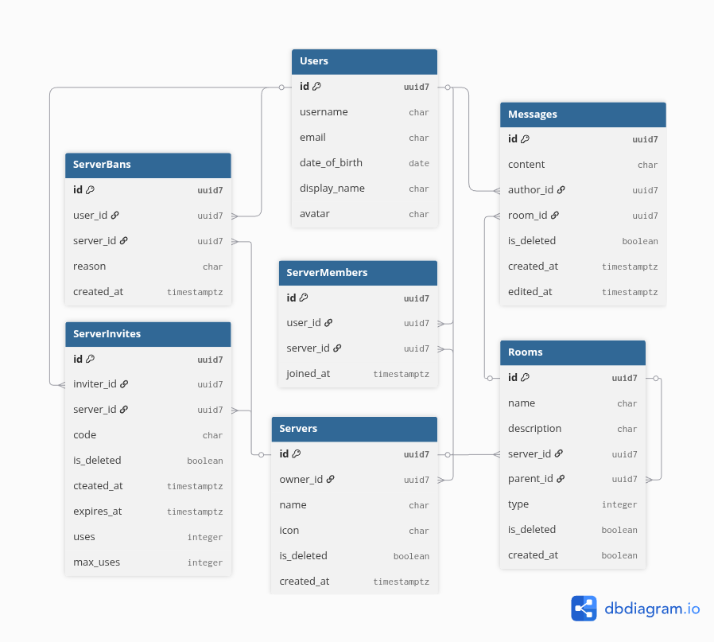

# Relayed - Chat for Communities

Free and open source community chat platform focused on privacy and simplicity, with zero ads, zero tracking, and transparent development.

Check it out at [relayed.cloud](https://relayed.cloud).

## Table of Contents

- [Features](#features)
- [Tech Stack](#tech-stack)
- [Database Design](#database-design)
- [API Overview](#api-overview)
- [Running Locally](#running-locally)
- [Environment Variables](#environment-variables)
- [Future Improvements](#future-improvements)

## Features

- JWT Authentication (access + refresh)
- Account registration and login
- Custom usernames and display names
- Create and manage community servers
- Invite users with invite links
- Kick and ban members
- Text channels and categories
- Realtime messaging with WebSockets
- Message editing and deletion
- Cursor-style message pagination
- Automatic link formatting
- Responsive chat interface

## Tech Stack

- **Backend:** Django, DRF, Django Channels, Daphne
- **Frontend:** Vite, TypeScript, React, Tailwind CSS
- **Infrastructure:** Docker, Nginx, PostgreSQL, Redis

## Database Design



## API Overview

#### Auth

| Endpoint         | Method | Permission | Description              |
| ---------------- | ------ | ---------- | ------------------------ |
| `/auth/register` | POST   | Unauth     | Register user            |
| `/auth/token`    | POST   | Unauth     | Get JWT access & refresh |
| `/auth/refresh`  | POST   | Unauth     | Refresh access token     |

#### Users

| Endpoint                           | Method | Permission | Description       |
| ---------------------------------- | ------ | ---------- | ----------------- |
| `/users/@me`                       | GET    | Auth       | Current user info |
| `/users/@me/servers`               | GET    | Auth       | User's servers    |
| `/users/@me/servers/<uuid>/member` | GET    | Member     | Membership info   |
| `/users/<uuid>`                    | GET    | Auth       | Public user info  |

#### Servers

| Endpoint                         | Method              | Permission     | Description                   |
| -------------------------------- | ------------------- | -------------- | ----------------------------- |
| `/servers/<uuid>`                | GET                 | Member         | Server details                |
| `/servers/<uuid>`                | PATCH / DELETE      | Owner          | Update / Delete server        |
| `/servers/<uuid>/rooms`          | GET / POST          | Member / Owner | List / Create channels        |
| `/servers/<uuid>/members`        | GET                 | Member         | List members                  |
| `/servers/<uuid>/members/<uuid>` | GET / DELETE        | Owner          | Member info / Ban             |
| `/servers/<uuid>/invites`        | GET / POST          | Member         | List / Create invites         |
| `/servers/<uuid>/bans`           | GET                 | Owner          | List bans                     |
| `/servers/<uuid>/bans/<uuid>`    | GET / POST / DELETE | Owner          | Ban / Unban / Get ban details |

#### Rooms

| Endpoint                        | Method         | Permission     | Description              |
| ------------------------------- | -------------- | -------------- | ------------------------ |
| `/rooms/<uuid>`                 | GET            | Member         | Room details             |
| `/rooms/<uuid>`                 | PATCH / DELETE | Owner          | Update / Delete room     |
| `/rooms/<uuid>/messages`        | GET / POST     | Member         | Retrieve / Send messages |
| `/rooms/<uuid>/messages/<uuid>` | PATCH / DELETE | Author / Owner | Edit / Delete message    |

#### Invites

| Endpoint          | Method     | Permission | Description                   |
| ----------------- | ---------- | ---------- | ----------------------------- |
| `/invites/<code>` | GET / POST | Auth       | Get invite info / Join server |

## Running Locally

#### Installation

```bash
# clone the repository
git clone https://github.com/gdbxcvgg/Relayed.git

# enter repository directory
cd Relayed

# set up .env files
cd env
cp .env.local.example .env.local
cp .env.prod.example .env.prod
```

#### Backend

```bash
# enter backend directory
cd backend

# create a virtual enviroment
python -m venv .venv

# activate the virtual environment
source .venv/bin/activate

# install dependencies
pip install -r requirements.txt

# apply database migrations
python manage.py migrate

# run development server
python manage.py runserver
```

#### Frontend

```bash
# enter frontend directory
cd frontend

# install dependencies
npm install

# run development server
npm run dev
```

Now you can access the page at: http://localhost:3000

## Environment Variables

| Variable                      | Description                        |
| ----------------------------- | ---------------------------------- |
| `POSTGRES_USER`               | PostgreSQL container username      |
| `POSTGRES_PASSWORD`           | PostgreSQL container password      |
| `POSTGRES_DB`                 | PostgreSQL container database name |
| `DJANGO_DEBUG`\*              | Enable Django debug mode           |
| `DJANGO_SETTINGS_MODULE`      | Django settings module             |
| `DJANGO_SECRET_KEY`\*         | Django secure secret key           |
| `DJANGO_ALLOWED_HOSTS`        | Allowed Django hosts               |
| `DJANGO_DB_ENGINE`            | Database engine                    |
| `DJANGO_DB_HOST`              | Database host                      |
| `DJANGO_DB_PORT`              | Database port                      |
| `DJANGO_DB_USER`              | Database username                  |
| `DJANGO_DB_PASSWORD`          | Database password                  |
| `DJANGO_DB_NAME`              | Database name                      |
| `DJANGO_CORS_ALLOWED_ORIGINS` | List of allowed CORS origins       |
| `VITE_API_BASE_URL`\*         | Backend API base URL               |
| `VITE_GATEWAY_URL`\*          | WebSocket gateway URL              |
| `VITE_APP_ROOT`\*             | Frontend application root URL      |

\* Required for development. All variables are required in production.

## Future Improvements

- Voice channels
- Friends and DMs
- User presence
- Message reactions
- Message search
- Role-based permissions
- Typing indicators
- Media upload
- 2fa auth
